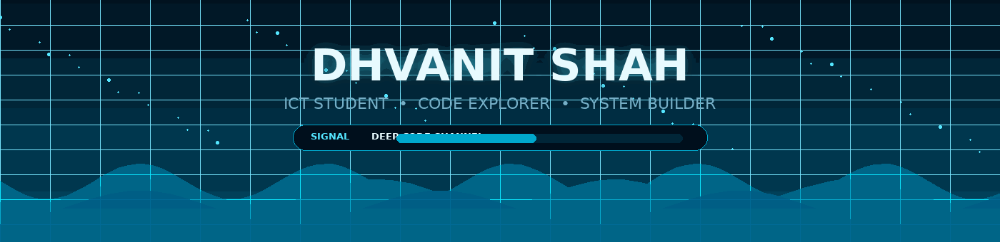
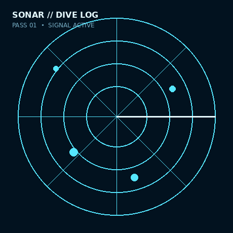
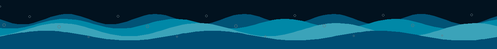

<div align="center">



### `DEEP CODE CHANNEL // ONLINE`

<a href="https://github.com/shahdhvanit">
  
</a>

<br>


<br><br>

<a href="https://www.linkedin.com/in/dhvanit-shah-cs/">
  
</a>
<a href="mailto:shahdhvanit4@gmail.com">
  
</a>
<a href="https://github.com/shahdhvanit">
  
</a>

</div>

<br>


---

# `01` // PROFILE

<table>
<tr>
<td width="62%" valign="top">

## 🧭 `whoami`

I'm a **Computer Science student** who enjoys turning problems into working systems.

My main currents are:

- **Algorithms** → DSA, problem solving & logical thinking
- **Programming** → C++ & Python
- **Data** → PostgreSQL, SQL & database design
- **Building** → practical projects that mix code, logic and systems

> **I don't want to just write code.**  
> **I want to understand what happens beneath it.**

</td>
<td width="38%" align="center" valign="middle">



</td>
</tr>
</table>

---

# `02` // DIVE MAP

> **Most people see the surface. I like exploring what is underneath it.**

| 🌊 Depth | What lives there |
|:--|:--|
| `SURFACE` | C • C++ • Python • Git • GitHub • VS Code |
| `MIDWATER` | DSA • Algorithms • Problem Solving • Simulation |
| `THERMOCLINE` | PostgreSQL • SQL • Schema Design • Analytics |
| `ABYSS` | Processes • Concurrency • Resource Thinking • Systems |



---

# `03` // TECH DECK

<div align="center">

### ⚓ Core Languages


### 🪸 Data / Tools / Workflow


<br><br>


</div>

---

# `04` // PROJECT REEF

<div align="center">

<table>
<tr>
<td width="50%" valign="top">

### 🎮 Game Database Dashboard

<a href="https://github.com/shahdhvanit/Game-Database-Dashboard">

</a>

**THE DATA REEF**  
A PostgreSQL game database focused on player statistics, match analytics and stored procedures.

`PostgreSQL` `SQL` `Database`

</td>
<td width="50%" valign="top">

### 🚦 Traffic Simulation Project

<a href="https://github.com/shahdhvanit/TRAFFIC_SIMULATION_PROJECT">

</a>

**THE CURRENT SIMULATOR**  
A C-based simulation project built around traffic flow, routing and algorithmic decision making.

`C` `Simulation` `Algorithms`

</td>
</tr>

<tr>
<td width="50%" valign="top">

### 🗓️ Automated Time-Table Generator

<a href="https://github.com/shahdhvanit/Automated_TimeTable_Generator">

</a>

**THE SCHEDULER**  
A C++ project for generating academic time-tables through programmatic scheduling logic.

`C++` `Algorithms`

</td>
<td width="50%" valign="top">

### 🧩 DSA Lab Map

<a href="https://github.com/shahdhvanit/DSA_Lab_map">

</a>

**THE TRENCH LAB**  
A C++ repository from the algorithmic side of the journey.

`C++` `DSA`

</td>
</tr>

<tr>
<td width="50%" valign="top">

### 🐍 SnakeGame

<a href="https://github.com/shahdhvanit/SnakeGame">

</a>

**THE FIRST REEF**  
A C++ game project built while experimenting with logic, interaction and game loops.

`C++` `Game`

</td>
<td width="50%" valign="top">

### 🧱 Tetris

<a href="https://github.com/shahdhvanit/Tetris">

</a>

**THE BLOCK CURRENT**  
A C++ Tetris implementation — a simple project with a lot of room for problem solving.

`C++` `Game`

</td>
</tr>
</table>

</div>

---

# `05` // CURRENT DIVE

<table>
<tr>
<td width="33%" valign="top">

### 🌊 `LEVEL 01`
## Algorithms

```text
DSA
├── problem solving
├── graph algorithms
├── dynamic programming
└── optimization mindset
```

</td>
<td width="33%" valign="top">

### ⚙️ `LEVEL 02`
## Systems

```text
Systems
├── C / C++
├── process concepts
├── concurrency
└── resource thinking
```

</td>
<td width="33%" valign="top">

### 🗄️ `LEVEL 03`
## Data

```text
Databases
├── PostgreSQL
├── SQL
├── schema design
└── analytics
```

</td>
</tr>
</table>

---

# `06` // SONAR LOG

<div align="center">


<br><br>


<br><br>


</div>

---

# `07` // ACHIEVEMENT REEF

<div align="center">


</div>

---

# `08` // REPOSITORY ARCHITECTURE

This profile is intentionally organized like a small project instead of a single giant Markdown file:

```text
shahdhvanit-profile/
│
├── .github/
│   └── workflows/
│       └── ocean-assets.yml      # keeps generated visuals reproducible
│
├── assets/
│   ├── ocean-header.gif          # animated deep-sea hero
│   ├── ocean-wave.gif            # animated wave strip
│   ├── ocean-divider.svg         # scalable animated divider
│   ├── sonar.gif                 # animated sonar panel
│   └── ocean.css                 # ocean design system / preview styles
│
├── scripts/
│   └── generate_ocean_assets.py  # regenerates the visual layer
│
└── README.md                     # profile presentation layer
```

### Why this structure?

| Layer | Job |
|:--|:--|
| `README.md` | Content, layout, links and profile narrative |
| `assets/` | All visuals, animations and theme definitions |
| `scripts/` | Reproducible asset generation instead of hand-editing binaries |
| `.github/workflows/` | Automation for regenerating the ocean layer |

---

# `09` // CONTACT CHANNELS

<div align="center">

<a href="https://github.com/shahdhvanit">

</a>
<a href="https://www.linkedin.com/in/dhvanit-shah-cs/">

</a>
<a href="mailto:shahdhvanit4@gmail.com">

</a>

</div>

<br>


<div align="center">

### 🌌 `END OF TRANSMISSION`

```text
        .         *          .        ~
    ~        .       🌊       .           *
       *          KEEP DIVING
            DEEPER INTO CODE
    .          ~       ~          .
          *        .        *
```

**Thanks for diving in.**

</div>
